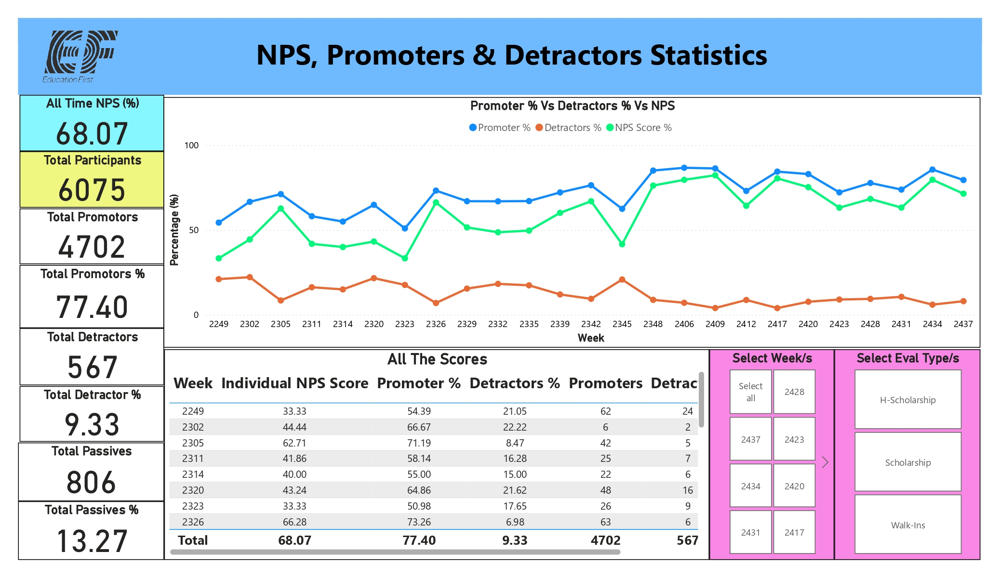

# 📌 EF Saudi Arabia – Student Evaluation & NPS Performance Dashboard

**Role:** Senior Data Analyst, Consultant  
**Domain:** Educational/Institutional Analytics  
**Objective:** The objective of this project is to provide an automated, interactive Power BI solution that transforms raw student feedback into actionable insights by tracking Net Promoter Scores (NPS) and service quality trends across multiple student categories.

---
This project is a comprehensive **Evaluation and Net Promoter Score (NPS) analytics dashboard** developed for the **Saudi Arabia operations of EF (Education First)**, a globally recognized English training organization. The dashboard analyzes student feedback collected through structured evaluations and surveys, covering different student types such as **Walk-Ins, Scholarships, and H-Scholarships**.

---
## 🛑 The Business Problem:
EF Saudi Arabia manages a high volume of student feedback across various programs (Scholarships, Walk-Ins, etc.), totaling over 6,000 participants. Historically, this data was processed manually in Excel, a process prone to human error and significant "insight lag". By the time the weekly NPS was calculated, the opportunity to address student grievances had often passed. The organization needed to eliminate manual bottlenecks to allow staff to focus on improving student satisfaction rather than just measuring it.

## ✔ The Solution:
An automated Power BI reporting suite that utilizes Power Query and DAX to provide real-time visibility into satisfaction metrics, reducing reporting turnaround time and ensuring data integrity.

The solution consolidates evaluation data across multiple weeks, transforms it using **Power Query**, and presents actionable insights through **interactive Power BI visuals**. It enables EF stakeholders to monitor student satisfaction, compare performance across evaluation types, and track trends in service quality, academic delivery, and overall student experience.

**[Click here to view the complete PDF report](Screenshots/Evaluation%20Report(NPS).pdf)**

---

## 🧠 Purpose

The purpose of this project is to provide a **centralized, automated, and reliable reporting solution** for monitoring **Net Promoter Score (NPS)** and evaluation performance. It supports **weekly and category-wise analysis**, enables meaningful comparisons, and helps stakeholders identify strengths and improvement areas while eliminating manual reporting efforts.

---

## 🧠 What’s Different from the Previous Excel Dashboard

Previously, all data extraction, cleaning, transformation, calculations, and visualizations were handled manually in **Excel** using formulas, pivot tables, and static charts.

With the implementation of **Power Query and Power BI**:

- Data preparation is fully automated and standardized  
- Complex calculations such as **NPS, Promoter %, Detractor %, and week-on-week comparisons** are handled efficiently using **DAX**  
- The dashboard is **interactive, scalable, and easy to refresh**  
- Filters and slicers enable instant analysis without modifying formulas  
- Visual indicators like **arrows and colors** provide faster and clearer insights  

Overall, the Power BI solution is **more robust, visually effective, and easier to maintain** than the earlier Excel-based dashboard.

---

## 📊 Features

- All-time NPS overview with total promoters, detractors, and passives  
- Weekly NPS trend analysis across multiple time periods  
- Evaluation type analysis for **Walk-Ins, Scholarships, and H-Scholarships**  
- Dynamic comparison of **any two selected weeks**  
- Directional arrows and color indicators showing performance improvement or decline  
- Submission volume comparison to correlate participation with NPS movement  
- Service and academic evaluation score tracking  
- Interactive slicers for weeks and evaluation types  
- Clean, user-friendly layout suitable for management and operational review  

---

## 🔍 Tools Used

- **Power BI Desktop**  
- **Power Query**  
- **DAX**  
- **Microsoft Excel**  

---

## 🔄 Data Flow

The diagram below illustrates how data flows from source systems to the final Power BI dashboard:

---

## 📸 Screenshots

*All the screenshots and PDFs are in the [Screenshot](Screenshots) folder.*

---

## 👤 Consultant

**Atif Noorul Hasan**  
Healthcare Analytics Consultant  
Business Intelligence | Data Analytics | Dashboard Design  

🔗 Website – https://atifdata.com  
✉️ Email – atif@atifdata.com
